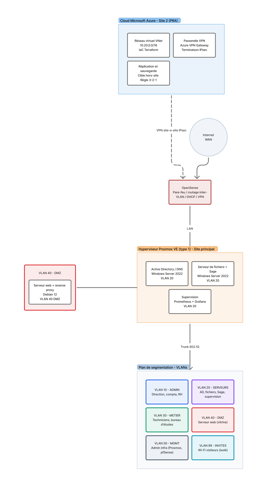

# SOLARIS — Conception d'une infrastructure virtualisée hybride
### Rapport MSPR Virtualisation — M2 Expert Cloud & Infrastructure (YNOV Bordeaux)

---

## Équipe

Ce rapport est réalisé dans le cadre de la MSPR Virtualisation. L'équipe joue le rôle de **prestataire d'infrastructure** auprès de la société fictive **SOLARIS**, installateur de solutions photovoltaïques.

| Nom Prénom | Rôle sur le projet |
|---|---|
| **Thibault DIJOUX--BREZOT** | Socle on-premise : Proxmox VE, Active Directory, serveur de fichiers, sauvegardes |
| **Felipe NOLIBOIS**  | Gestionnaire d'architecture réseau |
| **Yann EYHEREGARAY**  | Hybridation cloud Azure, IaC (Terraform) |

---

## Résumé

SOLARIS est un installateur photovoltaïque d'une cinquantaine de collaborateurs réparti sur deux sites. Son système d'information actuel souffre de plusieurs faiblesses : un site vitrine hébergé sur une plateforme propriétaire (Wix) peu maîtrisée, un logiciel de gestion **Sage** installé en local sans sauvegarde robuste, un portail de supervision des installations photovoltaïques exposé sans protection adaptée, l'absence de segmentation réseau et l'absence de plan de reprise d'activité.

Ce rapport propose une **architecture cible** répondant aux exigences de **sécurité**, de **disponibilité** et de **croissance** de l'entreprise. L'orientation retenue est une approche **hybride** : un socle de virtualisation **Proxmox VE** sur le site principal pour héberger le cœur métier et les données, et le **cloud Microsoft Azure** comme second site dédié à la reprise d'activité (PRA). La conception couvre la virtualisation, la segmentation réseau par VLAN, l'hybridation cloud, la supervision, la sauvegarde et le plan de reprise/continuité, ainsi que les volets résilience et postes de travail.

---

## Sommaire

1. [Contexte et analyse de l'existant](#partie-1--contexte-et-analyse-de-lexistant)
2. [Analyse des risques](#partie-2--analyse-des-risques)
3. [Architecture cible](#partie-3--architecture-cible)
4. [Virtualisation : hyperviseur et dimensionnement](#partie-4--virtualisation--hyperviseur-et-dimensionnement)
5. [Sécurité réseau : segmentation et filtrage](#partie-5--sécurité-réseau--segmentation-et-filtrage)
6. [Hybridation cloud et accès distant](#partie-6--hybridation-cloud-et-accès-distant)
7. [Supervision](#partie-7--supervision)
8. [Sauvegarde, PRA et PCA](#partie-8--sauvegarde-pra-et-pca)
9. [Résilience et virtualisation Hyper-V](#partie-9--résilience-et-virtualisation-hyper-v)
10. [Postes de travail et VDI](#partie-10--postes-de-travail-et-vdi)
- [Évolutions par rapport au sujet de base](#évolutions-par-rapport-au-sujet-de-base)
- [Conclusion](#conclusion)
- [Sources](#sources)

---

## Partie 1 — Contexte et analyse de l'existant

SOLARIS conçoit, vend et installe des centrales photovoltaïques pour des clients particuliers et industriels. L'entreprise compte environ cinquante personnes : une direction, des fonctions support (comptabilité, ressources humaines), un bureau d'études et des équipes de techniciens souvent en déplacement sur les chantiers. L'activité s'appuie également sur la **supervision à distance des installations** déjà posées, via un portail de monitoring photovoltaïque consultable par l'entreprise et par certains clients.

Le système d'information existant présente la photographie suivante :

- un **site vitrine** hébergé sur une solution SaaS propriétaire (Wix), ce qui limite la maîtrise technique et crée une dépendance à l'éditeur ;
- le logiciel **Sage** (gestion commerciale et comptable) installé **en local** sur un poste ou un serveur, sans politique de sauvegarde formalisée ;
- un **portail de supervision photovoltaïque** accessible depuis l'extérieur, sans authentification renforcée ni protection applicative ;
- un **réseau à plat**, sans séparation entre les usages administratifs, métiers, serveurs et visiteurs ;
- **aucun plan de reprise d'activité** documenté, alors que l'arrêt du SI immobiliserait la facturation, le suivi client et la supervision des installations.

La croissance de l'entreprise et l'ouverture d'un second site rendent nécessaire la **fiabilisation** et la **structuration** de ce système d'information.

---

## Partie 2 — Analyse des risques

Avant toute proposition technique, l'équipe a identifié les principaux risques pesant sur SOLARIS.

**Sécurité et confidentialité.** L'absence de segmentation réseau signifie qu'un poste compromis ou un visiteur connecté au Wi-Fi peut atteindre les serveurs et les données de gestion. Le portail de supervision exposé sans protection constitue une porte d'entrée potentielle vers le SI.

**Disponibilité.** Sans plan de reprise ni sauvegarde externalisée, un sinistre (panne matérielle, ransomware, incendie) entraînerait une perte de données et un arrêt prolongé de l'activité. La dépendance à une connexion internet unique constitue également un point de défaillance.

**Maîtrise et pérennité.** L'hébergement du site sur Wix et l'installation de Sage en local, hors de toute infrastructure gérée, rendent l'ensemble difficile à sauvegarder, à mettre à jour et à superviser.

**Mobilité.** Les techniciens en déplacement n'ont pas d'accès distant sécurisé au système d'information, ce qui dégrade leur productivité.

Ces risques structurent les choix d'architecture présentés dans la suite.

---

## Partie 3 — Architecture cible

L'architecture proposée repose sur une logique de répartition claire : **le site principal héberge le cœur métier et les données** (maîtrise, performance, données qui restent chez SOLARIS), tandis que **le cloud Azure assure la résilience** en tant que second site de reprise d'activité. La segmentation réseau par VLAN isole les usages, et un tunnel VPN site-à-site relie de façon sécurisée les deux environnements.

***Figure 1 — Architecture cible SOLARIS (hybride on-premise / cloud).***

Le schéma se lit de haut en bas : le cloud Azure (site 2, dédié au PRA) en haut, relié par un tunnel VPN IPsec au pare-feu **pfSense** du site principal ; sous pfSense, l'hôte de virtualisation **Proxmox VE** héberge les machines virtuelles du cœur métier ; en bas, le **plan de segmentation par VLAN** documente l'isolation des différents usages du réseau.

---

## Partie 4 — Virtualisation : hyperviseur et dimensionnement

**Choix de l'hyperviseur.** L'équipe retient **Proxmox VE** comme hyperviseur de type 1 pour le site principal. Ce choix se justifie par sa gratuité (pas de coût de licence, contrairement à VMware ESXi dont le modèle de licence s'est durci depuis le rachat par Broadcom), par sa maturité (virtualisation KVM et conteneurs LXC), par sa prise en charge native du **cluster à haute disponibilité** et par l'intégration de **Proxmox Backup Server** pour les sauvegardes. XCP-ng a été envisagé comme alternative open source crédible, mais l'écosystème Proxmox et son intégration sauvegarde ont été jugés plus adaptés au contexte.

**Cluster et haute disponibilité.** Pour éviter qu'une panne matérielle n'arrête le SI, l'architecture cible prévoit un **cluster Proxmox à deux nœuds** (avec mécanisme de quorum) permettant le redémarrage automatique des machines virtuelles sur le second nœud en cas de défaillance.

**Dimensionnement des machines virtuelles.** Les ressources sont estimées au regard des usages d'une cinquantaine d'utilisateurs.

| Machine virtuelle | Système | vCPU | RAM | Stockage | Rôle |
|---|---|---|---|---|---|
| Active Directory / DNS | Windows Server 2022 | 2 | 4 Go | 80 Go | Authentification, DNS, GPO |
| Serveur de fichiers + Sage | Windows Server 2022 | 4 | 8 Go | 80 Go + 500 Go | Partages réseau, ERP Sage |
| Serveur web + reverse proxy | Debian 12 | 2 | 4 Go | 40 Go | Site vitrine, accès au monitoring PV |
| Supervision | Debian 12 | 2 | 4 Go | 80 Go | Prometheus, Grafana, alertes |

**Isolation et moindre privilège.** Chaque VM est rattachée au VLAN correspondant à son usage (voir Partie 5) et les accès aux ressources s'appuient sur l'annuaire Active Directory et le modèle de groupes par métier puis par ressource (logique AGDLP).

---

## Partie 5 — Sécurité réseau : segmentation et filtrage

La segmentation par **VLAN** constitue la pierre angulaire de la sécurité réseau de SOLARIS. Elle est portée par un commutateur administrable et par le pare-feu **pfSense**, qui assure le routage inter-VLAN, le filtrage, le service DHCP et la terminaison des VPN.

| VLAN | Nom | Usage |
|---|---|---|
| 10 | ADMIN | Postes direction, comptabilité, RH |
| 20 | SERVEURS | AD/DNS, serveur de fichiers + Sage, supervision |
| 30 | MÉTIER | Postes techniciens et bureau d'études |
| 40 | DMZ | Serveur web exposé (site vitrine, reverse proxy) |
| 50 | MGMT | Interfaces d'administration (Proxmox, pfSense, commutateur) |
| 99 | INVITÉS | Wi-Fi visiteurs, isolé du reste du réseau (accès internet seul) |

Les principes de filtrage retenus sont les suivants : le VLAN **INVITÉS** est totalement isolé du SI ; le VLAN **DMZ** ne peut initier aucune connexion vers le LAN interne ; les flux entre VLAN ne sont autorisés que lorsqu'ils sont strictement nécessaires (par exemple les postes métier vers les partages de fichiers). Le **service DHCP est porté par pfSense** et non par l'Active Directory.

Des mesures complémentaires renforcent la sécurité : **chiffrement des disques** (BitLocker) sur le serveur hébergeant Sage et les partages, **authentification multifacteur (MFA)** pour les accès distants et pour le portail de supervision, et mise en place d'un **reverse proxy avec pare-feu applicatif (WAF)** devant le portail de monitoring photovoltaïque exposé.

---

## Partie 6 — Hybridation cloud et accès distant

L'hybridation repose sur l'usage du **cloud Microsoft Azure comme second site**, dédié à la reprise d'activité. Plutôt que de monter une seconde salle serveur physique, SOLARIS bénéficie d'une seconde « région » à la demande, sans investissement matériel lourd.

**Infrastructure as Code.** L'ensemble des ressources Azure (réseau virtuel, passerelle VPN, stockage de sauvegarde) est décrit en **Terraform**, avec un **état distant** (remote state). Cette approche garantit la reproductibilité, la traçabilité des modifications et la possibilité de reconstruire l'environnement à l'identique.

**Liaison sécurisée.** Un **VPN site-à-site IPsec** relie le pare-feu pfSense du site principal à l'**Azure VPN Gateway**. Les deux environnements communiquent ainsi de manière privée et chiffrée à travers l'internet public.

**Accès distant des collaborateurs.** Les techniciens nomades accèdent au SI via un **VPN SSL** via Wireguard, assorti d'une authentification multifacteur, leur permettant de travailler comme s'ils étaient au siège.

**Accès des clients industriels.** Les clients consultant la supervision de leurs installations y accèdent en **lecture seule** via le reverse proxy protégé par WAF et MFA, sans jamais entrer dans le réseau interne.

---

## Partie 7 — Supervision

La supervision (ou monitoring) vise à détecter les incidents avant qu'ils n'affectent les utilisateurs et à objectiver l'état du SI. Une **machine virtuelle dédiée** héberge la pile **Prometheus + Grafana + Alertmanager** :

- **Prometheus** collecte les métriques via des agents (exporters) : `node_exporter` pour les serveurs Linux, `windows_exporter` pour les serveurs Windows, l'exporter Proxmox pour l'hyperviseur, et `blackbox_exporter` pour tester la disponibilité des services exposés (site vitrine, portail de supervision) ;
- **Grafana** présente les tableaux de bord (charge CPU/RAM, espace disque, état des VM, disponibilité des sites) ;
- **Alertmanager** déclenche les **alertes** (par courriel) en cas de dépassement de seuil ou d'indisponibilité.

Côté cloud, **Azure Monitor** assure le suivi des ressources Azure ; les deux sources peuvent être unifiées dans une même instance Grafana pour une vision d'ensemble.

---

## Partie 8 — Sauvegarde, PRA et PCA

**Stratégie de sauvegarde (règle 3-2-1).** L'architecture applique la règle **3-2-1** : trois copies des données, sur deux types de supports différents, dont une copie externalisée hors site. Concrètement, **Proxmox Backup Server** réalise les sauvegardes locales des machines virtuelles, et une **copie est externalisée vers Azure** (site 2).

**Plan de reprise d'activité (PRA).** Le second site Azure constitue la cible de reprise. En cas de sinistre majeur sur le site principal, les services critiques (fichiers, Sage, annuaire) peuvent être relancés à partir des données répliquées dans Azure. Des objectifs cibles sont proposés à titre d'exemple :

| Indicateur | Cible proposée | Signification |
|---|---|---|
| **RPO** (Recovery Point Objective) | ≤ 24 h | Perte de données maximale tolérée |
| **RTO** (Recovery Time Objective) | ≤ 4 h | Délai de remise en service maximal |

**Plan de continuité d'activité (PCA).** Pour se rapprocher de l'exigence de forte disponibilité, l'architecture prévoit une **redondance de l'accès internet** (lien fibre principal + lien 4G/5G de secours en bascule automatique sur le pare-feu) et une **fenêtre de maintenance planifiée** (week-end) pour valider les redémarrages et les restaurations.

**Tests de restauration.** Dans une mise en œuvre réelle, des **tests de restauration périodiques** valideraient l'efficacité du dispositif ; ils sont ici décrits à titre de procédure cible.

---

## Partie 9 — Résilience et virtualisation Hyper-V

Au-delà de Proxmox retenu pour la production, le module impose de traiter le volet **Hyper-V et résilience**. L'équipe propose, en variante pédagogique, l'usage de la **réplication Hyper-V (Hyper-V Replica)** comme mécanisme de réplication de machines virtuelles vers le second site. Cette variante illustre une approche alternative de résilience inter-sites : une VM est répliquée à intervalle régulier vers un hôte Hyper-V distant, prêt à prendre le relais en cas de défaillance du site principal.

Cette section met ainsi en perspective deux familles de solutions de résilience : la **haute disponibilité par cluster** (Proxmox HA, traitée en Partie 4) pour les pannes locales, et la **réplication inter-sites** (vers Azure, ou via Hyper-V Replica) pour les sinistres affectant un site entier.

---

## Partie 10 — Postes de travail et VDI

La virtualisation des postes de travail (**VDI**) est étudiée comme **perspective** pour SOLARIS. Elle présenterait un intérêt pour deux populations : les **techniciens nomades**, qui pourraient retrouver un environnement de travail standardisé et sécurisé depuis un chantier, et les **postes partagés** au sein de l'entreprise.

Une solution légère est proposée : la mise à disposition d'un **bureau ou d'applications à distance** (services Bureau à distance, ou solution de passerelle de type Apache Guacamole devant les machines virtuelles), couplée à des **profils utilisateurs** gérés via l'Active Directory. Compte tenu de la taille de l'entreprise, ce volet est positionné comme **optionnel** et conditionné à l'évolution des besoins, afin de ne pas alourdir inutilement l'infrastructure cible.

---

## Évolutions par rapport au sujet de base

Au fil de la conception, plusieurs choix ont fait évoluer la proposition par rapport à l'énoncé initial :

- **Ajout d'un Active Directory / DNS** : non explicitement demandé au départ, il s'impose pour gérer de manière centralisée une cinquantaine d'utilisateurs, l'authentification et les droits sur les partages.
- **Maintien de Sage en local** (et non en SaaS) : l'arbitrage retenu conserve Sage sur un serveur interne, sécurisé et sauvegardé, plutôt que de basculer vers une offre hébergée.
- **Sortie de Wix** : le site vitrine est rapatrié sur une machine virtuelle Debian derrière un reverse proxy, pour gagner en maîtrise et permettre supervision et sauvegarde.
- **Le second site devient un site cloud Azure dédié au PRA**, au lieu d'une seconde salle serveur physique, pour limiter l'investissement matériel.
- **Distinction explicite** entre le « monitoring photovoltaïque » (application métier exposée aux clients) et la « supervision » du SI (pile Prometheus/Grafana interne), deux notions initialement confondues.

---

## Conclusion

L'architecture cible proposée pour SOLARIS répond aux quatre enjeux identifiés : la **sécurité** (segmentation par VLAN, MFA, WAF, chiffrement), la **disponibilité** (cluster Proxmox, redondance internet, PRA dans Azure), la **maîtrise** (rapatriement du site vitrine, supervision centralisée, Infrastructure as Code) et la **croissance** (modèle hybride extensible, second site cloud). La démarche reste **théorique et conceptuelle**, mais elle constitue une base directement exploitable pour une mise en œuvre ultérieure. Les perspectives principales sont le déploiement effectif du socle Proxmox, l'industrialisation complète de la partie Azure en Terraform/OpenTofu, et l'évaluation du besoin réel en VDI au regard de la mobilité des équipes.

---

## Sources

- **Figure 1** — Schéma d'architecture cible SOLARIS (`solaris-architecture-cible.svg`) : **réalisé par l'équipe** dans le cadre du projet. © Équipe MSPR SOLARIS.
- Documentation officielle **Proxmox VE** — *Proxmox Server Solutions GmbH*.
- Documentation officielle **Microsoft Azure** (Virtual Network, VPN Gateway, Azure Monitor) — *Microsoft*.
- Documentation officielle **pfSense** — *Netgate*.
- Documentation officielle **Prometheus** et **Grafana** — *Prometheus Authors / Grafana Labs*.
- Documentation **Terraform / OpenTofu** — *HashiCorp / OpenTofu*.

> *Toutes les données, schémas et illustrations de ce rapport ont été produits par l'équipe. Les marques et logiciels cités appartiennent à leurs éditeurs respectifs.*
